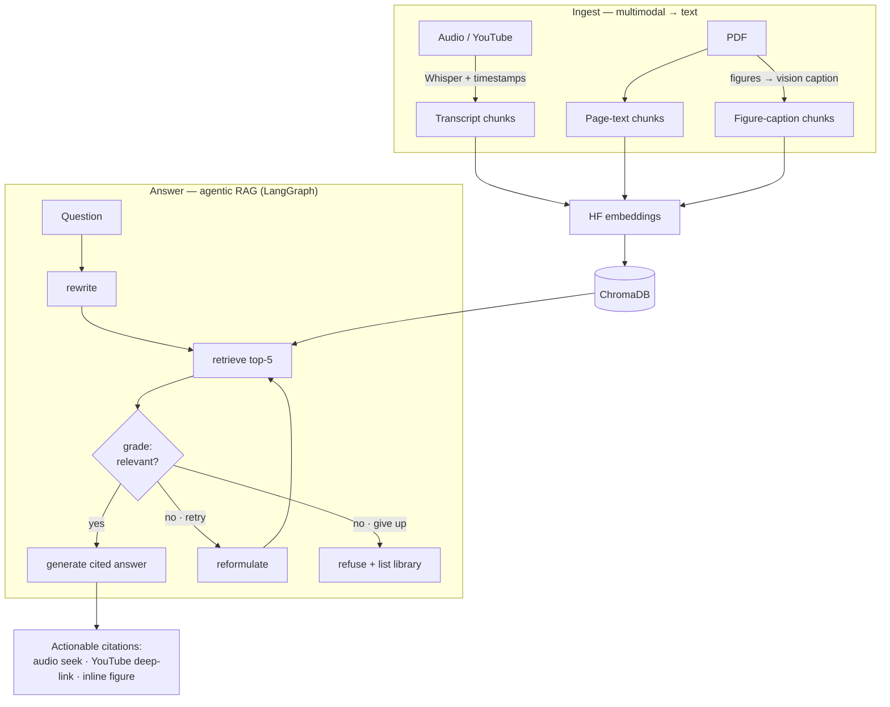

# 🎓 CourseLens


**Chat with your whole course.** Ingest lecture recordings, slide PDFs, and their
figures into one searchable knowledge base, then ask questions and get grounded
answers where **every citation is actionable** — click a source and the audio
jumps to the exact moment, or the referenced figure appears inline.

CourseLens is a multimodal, *agentic* RAG study tool built with LangGraph — a
RAG backbone expanded to cross modalities and to cite its sources by timestamp.

**Highlights**
- 🎧 **Multimodal ingest** — audio, YouTube, and slide PDFs (incl. figures) in one knowledge base
- 🔗 **Actionable citations** — click to seek audio/video to the exact second, or view the cited figure inline
- 🧠 **Corrective-RAG grader** — grades retrieval relevance, retries with a reformulated query, and refuses deterministically instead of trusting the generator's judgment
- 📊 **Measured, not vibes** — an eval harness with retrieval hit-rate, groundedness, and a grader ablation
- 🗺️ **Course Map** — an interactive concept graph over your whole course
- ⚙️ **Instrumented** — per-query latency + token usage

> **Status: V6 (feature-complete)** — audio + PDF (text & figures) ingestion, a
> **corrective-RAG grader** (retry-then-refuse), an **eval harness** (hit-rate,
> groundedness, grader ablation), **per-query instrumentation** (latency + tokens),
> deploy-ready, and a **Course Map** — an interactive concept graph over your library. See
> [`BUILD_PLAN.md`](BUILD_PLAN.md) for the roadmap, [`DEVLOG.md`](DEVLOG.md) for the
> build history, and [`PROJECT_OVERVIEW.md`](PROJECT_OVERVIEW.md) for a plain-language
> explanation.

---

## Architecture



Two things are worth calling out honestly:

- **Ingest routing is plain code, not an "agent"** — it's file-extension matching.
- **The genuinely agentic layer is the corrective-RAG grader** (V3): after retrieval
  it judges relevance and, if the context doesn't answer the question, reformulates
  and retries (capped) — then refuses rather than hallucinating. Every LLM call in a
  turn (rewrite + grade + retries + generate) is metered for latency and tokens.

## Screenshots

> Add captures to `docs/` (`chat.png`, `course-map.png`), then uncomment the block
> below to render them. Worth capturing: a cited answer with the **Sources** audio
> player, an answer rendering a slide **figure inline**, the **Course Map**, and the
> **eval table**.

<!-- Uncomment once the images exist in docs/:
| Chat — deep-linked citations | Course Map |
|---|---|
|  |  |
-->


## Tech stack

- **LangGraph** — orchestrates rewrite → retrieve → generate as a stateful graph
- **Groq Whisper** (`whisper-large-v3`) — audio transcription with timestamps
- **Groq** (`llama-3.3-70b-versatile`) — rewriting, generation, grading, eval judge
- **Groq vision** (`qwen/qwen3.6-27b`) — figure captioning so images are searchable
- **PyMuPDF** — PDF text + embedded-figure extraction
- **ChromaDB** + **HuggingFace embeddings** (`all-MiniLM-L6-v2`) — vector store
- **imageio-ffmpeg** — bundled ffmpeg for audio conversion/splitting (no system install)
- **yt-dlp** — YouTube audio extraction (local-only bonus)
- **Streamlit** + **streamlit-agraph** — chat UI with actionable citations, and the Course Map concept graph

## Setup & run

**Prerequisites:** Python 3.10+, a free [Groq API key](https://console.groq.com).

```bash
python -m venv venv
source venv/bin/activate            # Windows: venv\Scripts\activate
pip install -r requirements.txt

cp .env.example .env                # then edit .env and set GROQ_API_KEY
streamlit run frontend/app.py
```

Add a lecture (audio file or, locally, a YouTube URL) in the sidebar, wait for it
to transcribe, then ask questions. Answers cite their sources; expand **Sources**
to play the audio from the exact cited moment.

> ffmpeg is bundled via `imageio-ffmpeg`, so no separate install is needed. A
> 60–90 minute lecture is transcoded to FLAC and split automatically before
> transcription.

## Evaluation

CourseLens ships with an eval harness that turns the labeled test corpus into real
numbers — it doesn't just *work*, it's *measured*.

```bash
# ingest the test corpus, then evaluate (grader on vs off)
python -m backend.evals.run_evals --ingest
```

It reports, over a hand-labeled gold set ([`backend/evals/gold.jsonl`](backend/evals/gold.jsonl)):

- **Retrieval hit-rate@5** — is the correct source in the top-5 (timestamp ±60s / page ±1)?
- **Answer keyword match** — cheap correctness check
- **Groundedness** — LLM-as-judge: is every claim supported by the retrieved context?
- **Refusal accuracy** — do off-corpus questions get declined, not hallucinated?
- **Ablation** — the corrective-RAG grader **on vs off** on identical inputs

Results are written to `backend/evals/results.md`. The gold set covers **23 corpus
questions** (16 audio, 4 slide-text, 3 figure) plus **6 off-corpus** refusal checks —
3 blatant ("capital of France?") and 3 **topically-adjacent traps** (A\* search,
insertion sort, red-black trees: material the corpus is *near* but doesn't cover,
where a model is tempted to answer from its own knowledge).

**Current numbers** (full fresh run): retrieval hit-rate@5, keyword match,
groundedness, and refusal accuracy are all **100% in both grader modes**. The
corpus is small and clean — treat these as a regression floor, not a benchmark.

**Ablation — measured honestly:** an earlier version of this README claimed the
grader took off-corpus refusal accuracy from **0% → 100%**. Auditing showed that
number was an artifact of the metric: only the grader's exact refusal template
counted as a refusal, so the grader-off baseline — which declined in its own
words ("the provided context does not mention…") — was scored as hallucinating.
With honest refusal detection, the temperature-0 generator already declines every
off-corpus question, including the adjacent traps. What the grader actually buys
is **structural, not statistical**: a *deterministic* refusal path that doesn't
depend on the generator's judgment (or survive a model swap by luck), a bounded
reformulate-and-retry loop that can rescue marginal retrievals, and a refusal
message that tells the user what the library *does* cover.

## Tests & CI

The deterministic core — transcript chunking, grader parsing/routing, citation
filtering, eval scoring, concept-graph assembly, and the PDF figure pipeline
(vision stubbed) — is covered by an **offline pytest suite** (40 tests, no API
calls, runs in seconds):

```bash
pytest -q
```

Every push runs **lint (ruff) → compile → tests** via GitHub Actions
([`ci.yml`](.github/workflows/ci.yml)); a [`Jenkinsfile`](Jenkinsfile) defines the
same gate for a Jenkins server.

## Instrumentation

Every query displays its **latency, total token usage, and retrieval-attempt count**
in the UI, and appends a row to `query_log.csv` — cheap observability for tuning
and cost tracking.

## Deploy (Streamlit Community Cloud)

Runs on the free tier. The disk is **ephemeral** — `chroma_store/` and `media_store/`
reset on every restart, so users start with an empty library and re-ingest (fine for
a demo; worth noting to reviewers).

1. Push to GitHub.
2. Go to **[share.streamlit.io](https://share.streamlit.io)** → **Create app** → deploy from your repo.
3. **Main file path:** `frontend/app.py`.
4. **Advanced settings → Secrets** — paste:
   ```toml
   GROQ_API_KEY = "gsk_your_key_here"
   ENABLE_YOUTUBE = "0"   # yt-dlp is blocked from cloud IPs — hide the feature
   ```
5. Deploy. First build is slow — it installs PyTorch (via sentence-transformers), so allow several minutes.

ffmpeg is bundled through `imageio-ffmpeg`, so no `packages.txt` is needed. The
`test_dataset/` folder has a small lecture + slide deck to try immediately.

## Deploy (Docker)

For anywhere that runs containers:

```bash
docker build -t courselens .
docker run -p 8501:8501 -e GROQ_API_KEY=gsk_your_key \
  -v courselens-vectors:/app/chroma_store \
  -v courselens-media:/app/media_store courselens
```

The embedding model is baked into the image (no slow first boot), the volumes
persist your library across restarts, and a `HEALTHCHECK` watches Streamlit's
health endpoint. YouTube ingestion is off by default in containers (datacenter
IPs are blocked by YouTube); re-enable from a home IP with `-e ENABLE_YOUTUBE=1`.

## Roadmap

| Version | Adds |
|---|---|
| **V1** ✅ | Audio → timestamped, deep-linked RAG |
| **V2** ✅ | PDF text + figures (vision captions, figures shown inline) |
| **V3** ✅ | Corrective-RAG grader (the honest agentic loop) |
| **V4** ✅ | Eval harness — hit-rate, groundedness, grader ablation |
| **V5** ✅ | Per-query instrumentation (latency + tokens) + deploy-ready |
| **V6** ✅ | Course Map — interactive concept graph over the library |

### Planned / future work

- **Per-session library isolation** — today all uploads share one Chroma collection;
  scope collections by session id so users don't see each other's material.
- **Persistent storage** — Streamlit Cloud's disk is ephemeral; back the vector store
  with a hosted store (Chroma Cloud / Qdrant) so libraries survive restarts.
- **Streaming answers** — token-by-token generation for snappier responses.
- **Video ingestion** — sample on-screen slide frames, not just the audio track.
- **Larger eval set + CI eval gate** — expand the gold set and fail the build if
  retrieval hit-rate or groundedness drops below a threshold.
- **Demo hardening** — request caching + a visible "free-tier daily limit" notice so a
  shared-key public demo degrades gracefully under load.
